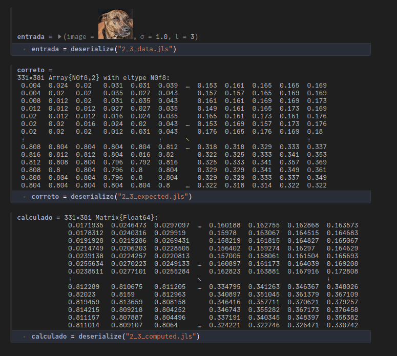

# Como utilizar os arquivos com exemplos de correção

A maioria das questões de listas e provas são corrigidas executando um conjunto
de entradas nas funções que deveriam ser implementadas. Se a função calcula
corretamente a reposta para cada entrada, ela é considerada correta. Caso algum
exemplo resulte em resposta incorreta, a questão é considerada errada.

Nesse processo são gerados arquivos que descrevem as entradas, os valores
computados e os valores esperados. Os alunos podem pedir que lhes envie esses
arquivos em um `.zip`. Eles podem então ser carregados e analisados para que se
possa entender o que ocorreu. Como exemplo, considere a questão 2.3 da lista 2.
Ela pedia:

👉 Escreva uma função que aplica a desfocagem gaussiana em uma imagem. Use as
funções que você já definiu e adicione as células extras para definir funções
auxiliares que você necessita. 

Além disso, abaixo havia um protótipo da função que você deveria implementar com
os nome e parâmetros de entrada. No caso:
```julia
function with_gaussian_blur(image; σ=3, l=5)

    return missing
end
```

Caso a lista entregue tenha um erro nessa questão. O arquivo `.zip` conterá além
do código original com a solução da lista, três arquivos de nomes
`2_3_computed.jls`, ` 2_3_data.jls` e ` 2_3_expected.jls`. Para conseguir
carregar e analisar os arquivos proceda da seguinte forma.

1. Coloque os arquivos todos em um mesmo diretório onde você tenha acesso a Julia e ao Pluto.
1. Inicie o Pluto e carregue a solução original da lista.
1. Na célula que carrega as bibliotecas adicione uma linha com `using Serialization`.
1. Na região do caderno em que está a resposta da questão com problemas adicione
   algumas células para poder carregar e analisar as informações. 
1. Para carregar o arquivo com os parâmetros de entrada coloque em uma nova
   célula algo como `entrada = deserialize("2_3_data.jls")`. Após executar a
   célula a variável `entrada` será um tupla nomeada com os parâmetros que podem
   ser usados na função. Outros arquivos podem ser abertos de maneira análoga.
   Veja a figura abaixo. 
   
1. Busque entender o que ocorreu. No exemplo acima, olhando o valor calculado no
   canto superior esquerdo, observa-se uma grande discrepância. Possivelmente a
   implementação com problemas não está lidando corretamente com a extensão da
   matriz além da borda. 
   
   Obs: As matrizes apresentadas são apenas dos canais vermelhos da resposta
   calculada e da resposta esperada.

Caso não seja possível identificar o problema dessa forma, então será necessário
analisar a situação com mais cuidado com o professor.